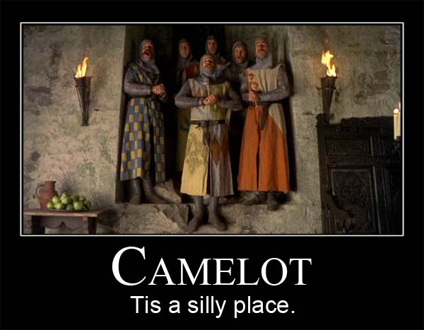

<!-- README.md is generated from README.Rmd. Please edit that file -->

```{r, include = FALSE}
knitr::opts_chunk$set(
  collapse = TRUE,
  comment = "#>"
)
```

# shnrble-api

<!-- badges: start -->
<!-- badges: end -->

This is a testing and dev repo that I'm using to play with REST APIs in R via the {plumber} library. Nothing in here should be taken very seriously, for this, like Camelot, is a silly place.  

  

## Current Stuff in Here:  
- **animal-sound**: A plumber API which returns the sounds that a dog makes in a few different languages. This also has an endpoint for counting and conversion to numbers, which ostensibly counts the number of cats and dogs provided.